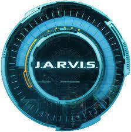
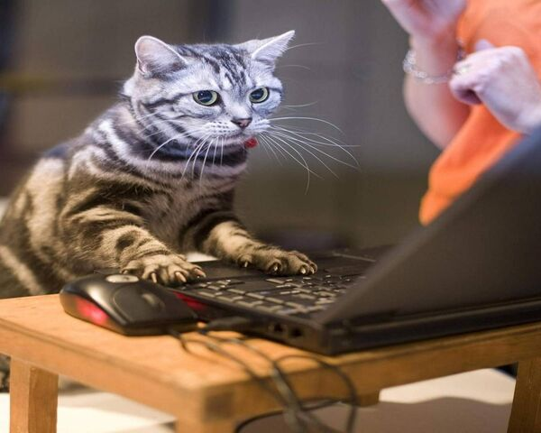

# AI School
* KICT 프로젝트반

    파이썬@ 
       <a href='https://www.facebook.com/dongjo.lim.7'>LDJ</a>
    , [임동조](frontierlim13@gmail.com)

<h2><b>데이터 사이언티스트 실무자</b></h2>

## Notice for Team Project

세미 프로젝트 진행(웹 데이터 수집 및 시각화, 데이터 분석)
* 기간 : 2022.10.21(금) ~ 2022.11.11(금)  
  * STEP 01. 프로젝트 기획서 작성  
  * STEP 02. 데이터 수집 및 처리/시각화/기본 모델 만들기 
  * STEP 03. 모델 개선/성능 개선 및 새로운 지식 익히기 
  * STEP 04. 2022.11.10(목) 22:00 최종 결과물 제출 
  * STEP 05. 프로젝트 결과 발표 11.11(금)  
  
* 팀별 최종 발표    
  * 2022.11.11(금) 09:00~13:00 (각 팀별 발표 시간 10분 내외)

## Reference Documents

# 문서초안-세부 사항은 변경될 수 있음.
- Proj-01. [포트폴리오 자료      ][proj-01]
- Proj-02. [프로젝트 결과보고서 포맷   ][proj-02]

[proj-01]:  ./docu/Goorm10_프로젝트보고서_포맷_OOO팀.docx "Go proj-01"
[proj-02]:  ./docu/팀별프로젝트수행_결과작성양식_kdigital.pptx "Go proj-02"

##  Pilot Project

- <b>1st Subject </b>: <b> 우리의 관심 분야 데이터 수집/분석해보기 </b>
- <b>Our Motto   </b>: <b> 작은 태도, 작은 땀, 작은 노력이 모여 더 나은 곳으로 인도합니다. </b>
- <b>Report Format </b>: <a href="./docu/Goorm10_프로젝트보고서_포맷_OOO팀.docx">(샘플)보고서 양식</a>
- ※ If you click on the image on the right, you can view "Initiation Report" by team.

<table border=1 bgcolor="#EEEEEE">
	<tr bgcolor="#CC0000">
		<td width="100">
		
<b>Team Name</b>

		</td>
		<td width="100">
		
<b>Team Building</b>

		</td>
		<td width="300">
		
<b>Project Subject</b>

		</td>
		<td width="120">
		
<b>Reports</b>

		</td>
	</tr>
	<tr>
		<td>
        
 팀명: ---  (팀장:---)  
            <b></b>
		

		</td>
		<td>
            
---- ---

        </td>
		<td>
			
 Kaggle Competition - Paddy Doctor 
</td>
		<td>
            
     
            

        </td>
	</tr>
	<tr>
		<td>
        
 팀명: ---  (팀장:---)  
            <b></b>
		

		</td>
		<td>
            
---- ---

        </td>
		<td>
			
 Kaggle Competition - Paddy Doctor 
</td>
		<td>
            
 
			    
            

        </td>
	</tr>
	<tr>
		<td>
        
 팀명: ---  (팀장:---)  
            <b></b>
		

		</td>
		<td>
            
---- ---

        </td>
		<td>
			
 Kaggle Competition - Paddy Doctor 
</td>
		<td>
            
    
            

        </td>
	</tr>
	<tr>
		<td>
        
 팀명: ---  (팀장:---)  
            <b></b>
		

		</td>
		<td>
            
---- ---

        </td>
		<td>
			
 Kaggle Competition - Paddy Doctor 
</td>
		<td>
            
     
            

        </td>
	</tr>
</table>

Goorm 프로젝트과정 4기! 최고 멋진 친구들 화이팅!!!

##   Project 
- <b>Submission   </b>: 착수보고, 결과보고, 소스코드
- <b>Presentation </b>: 10min / team, Q&A
- <b>Keep in mind </b>: <b> Share Lessons Learned !! </b>

 

 &lt; The End &gt; 

