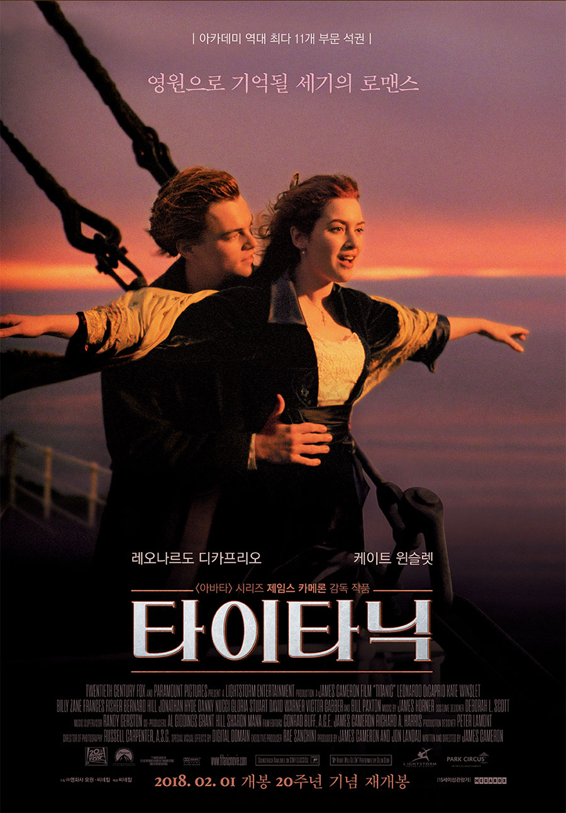

# AI School - Goorm 2회차
* Goorm AI 프로젝트반
  * 프로젝트 과정 
  * 기간 : 2022/07/04 ~ 2022/08/29

<h2><b>K-ICT 프로젝트반</b></h2>

## Notice for Team Project

프로젝트 진행(캐글 대회 참석 - American Express 대용량(50G) 데이터 분석)
* 기간 : 2022.08.05(금) ~ 2022.08.26(금)  
  * STEP 01. 데이터 셋 이해 및 EDA  
  * STEP 02. 데이터 시각화, 기본 모델 만들기 
  * STEP 03. 모델 선택 및 모델 평가 
  * STEP 04. 모델 최적화 
  * STEP 05. 학습한 내용 정리 및 최종 결과물 제출 
  
* 개인별 최종 결과물 제출    
  * ~2022.08.25(목)

##  Project

- <b>2nd Subject </b>: <b>Analyze Social Issues Using BigData </b>
- <b>Our Motto   </b>: <b>작은 땀의 결실과 성공이 모여 큰 성공을 이룬다. </b>
- ※ If you click on the image on the right, you can view "Initiation Report" by team.

<table border=1 bgcolor="#EEEEEE">
	<tr bgcolor="#CC0000">
		<td width="130">
		
<b>Name</b>

		</td>
		<td width="150">
		
<b>Team Building</b>

		</td>
		<td width="300">
		
<b>Project Subject</b>

		</td>
		<td width="120">
		
<b>Team Image</b>

		</td>
		<td width="120">
		
<b>Reports</b>

		</td>
	</tr>
	<tr>
		<td>
        
 팀명 : 타이타닉  (팀장:박윤수)  
            <b></b>
		

		</td>
		<td>
            
 박윤수, 김태경, 이정우, 최연우  

        </td>
		<td>
			
 American Express - Default Prediction 데이터 분석 

		</td>
		<td>
			
		</td>
		<td>
            
 
			  <a href=""> notion </a> 
		      <a href=""> 우리의 작품</a>    
            

        </td>
	</tr>
	<tr>
		<td>
        
 팀명: Random  (팀장:장윤서)  
            <b></b>
		

		</td>
		<td>
            
장윤서, 김찬별, 심연수, 이주행, 최찬혁 

        </td>
		<td>
			
 American Express - Default Prediction 데이터 분석 

		</td>
		<td>
			
		</td>
		<td>
            
 
			  <a href=""> notion </a> 
		      <a href=""> 우리의 작품</a>    
            

        </td>
	</tr>
	<tr>
		<td>
        
 팀명:Amazon  (팀장:정주희)  
            <b></b>
		

		</td>
		<td>
            
정주희, 손희경, 윤형석, 조기쁨 

        </td>
		<td>
			
 American Express - Default Prediction 데이터 분석 

		</td>
		<td>
			
		</td>
		<td>
            
 
			  <a href=""> notion </a> 
		      <a href=""> 우리의 작품</a>    
            

        </td>
	</tr>
	<tr>
		<td>
        
 팀명:MST  (팀장:박규리)  
            <b></b>
		

		</td>
		<td>
            
박규리, 박종민, 백진선, 최가은 

        </td>
		<td>
			
 American Express - Default Prediction 데이터 분석 

		</td>
		<td>
			
		</td>
		<td>
            
 
			  <a href=""> notion </a> 
		      <a href=""> 우리의 작품</a>    
            

        </td>
	</tr>

</table>

Goorm 인공지능 기본 과정 1기! 앞으로도 발걸음을 응원합니다!!!

 &lt; The End &gt; 

