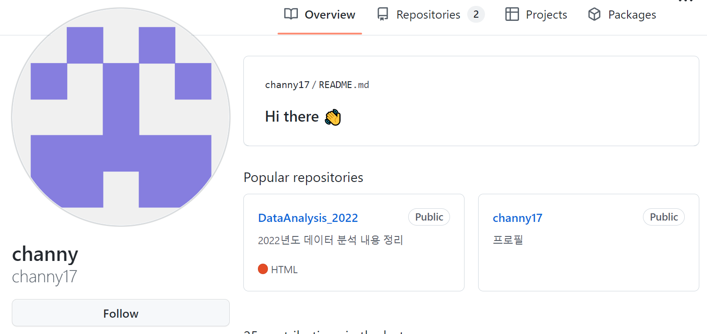
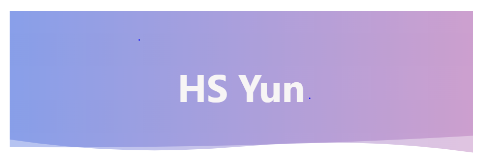
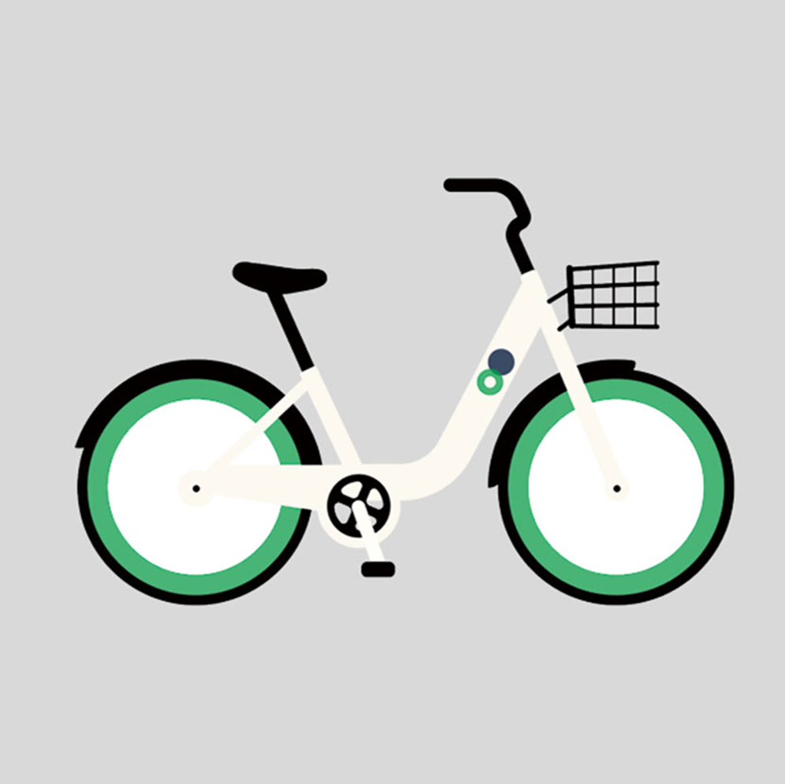
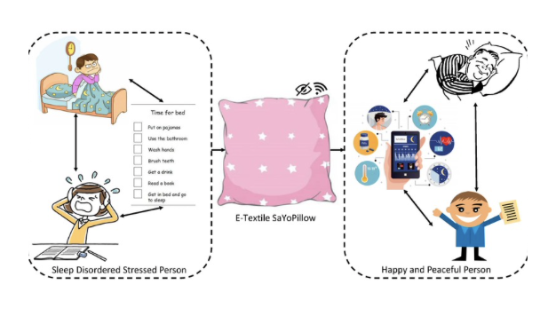

# AI School
* KICT 프로젝트반

    파이썬@ 
       <a href='https://www.facebook.com/dongjo.lim.7'>LDJ</a>
    , [임동조](frontierlim13@gmail.com)

<h2><b> 나의 첫번째 데이터 분석기 </b></h2>

## Notice for Team Project

세미 프로젝트 진행(데이터 선택, 데이터 EDA, 기본 모델 만들어보기)
* 기간 : 2022.08.08(월) ~ 2022.08.12(금)  

## Reference Documents

### 문서초안-세부 사항은 변경될 수 있음.
- Proj-01. [포트폴리오 자료      ][proj-01]
- Proj-02. [프로젝트 결과보고서 포맷   ][proj-02]

[proj-01]:  ./docu/Goorm10_프로젝트보고서_포맷_OOO팀.docx "Go proj-01"
[proj-02]:  ./docu/팀별프로젝트수행_결과작성양식_kdigital.pptx "Go proj-02"

<table border=1 bgcolor="#EEEEEE">
	<tr bgcolor="#CC0000">
		<td width="100">
		
<b>Team Name</b>

		</td>
		<td width="100">
		
<b>Team Building</b>

		</td>
		<td width="300">
		
<b>Project Subject</b>

		</td>
		<td width="150">
		
<b>데이터 URL</b>

		<td width="200">
		
<b>Reports</b>

		</td>
	</tr>
	<tr>
		<td>
        
 01. brain stroke 데이터 분석 </b> 

		</td>
		<td>
            
 팀장 : 최찬혁

        </td>
		<td>
			
 brain stroke 데이터 셋 

		</td>
		<td>
            
  
            데이터로 <a href="https://www.kaggle.com/datasets/jillanisofttech/brain-stroke-dataset"> 이동 </a>			
            

        </td>
	<td>
	    
 github로  <a href="https://github.com/channy17"> 이동  </a>

            
 나의 분석 발걸음 <a href="https://github.com/channy17/DataAnalysis_2022"> github </a>or notion

        </td>
	</tr>
	<tr>
		<td>
        
 02 영화 관객수 예측 </b> 

		</td>
		<td>
            
 팀장 : 최연우

        </td>
		<td>
			
 영화 관객수 예측 경진대회 데이터 셋 

		</td>
		<td>
            
  
            데이터로 <a href="https://dacon.io/competitions/open/235536/data"> 이동 </a>			
            

        </td>
	<td>
	    
 github로  <a href="https://github.com/yeonu9"> 이동  </a>

            
 나의 분석 발걸음 <a href="https://github.com/yeonu9/MyDataAnalysis_2022"> github </a> or notion

        </td>
	</tr>
	<tr>
		<td>
        
 03 airbnb 데이터 분석 </b> 

		</td>
		<td>
            
 팀장 : 최가은

        </td>
		<td>
			
 airbnb 데이터 셋 

		</td>
		<td>
            
  
            데이터로 <a href="https://www.kaggle.com/datasets/arianazmoudeh/airbnbopendata"> 이동 </a>			
            

        </td>
	<td>
	    
 github로  <a href="https://github.com/bestofGE"> 이동  </a>

            
 나의 분석 발걸음 <a href="https://bestofge.github.io/MyDataAnalysis/"> github </a> or notion

        </td>
	</tr>
	<tr>
		<td>
        
 04. 수면 데이터 분석 </b> 

		</td>
		<td>
            
 팀장 : 조기쁨

        </td>
		<td>
			
 수면 데이터 분석 

		</td>
		<td>
            
  
            데이터로 <a href="https://www.kaggle.com/datasets/jboysen/mri-and-alzheimers"> 이동 </a>			
            

        </td>
	<td>
	    
 github로  <a href="https://github.com/jogibbeum"> 이동  </a>

            
 나의 분석 발걸음 <a href=""> github </a> or notion  

        </td>
	</tr>
	<tr>
		<td>
        
 05. 의약품 사용 통계 분석 </b> 

		</td>
		<td>
            
 팀장 : 정주희 

        </td>
		<td>
			
 의약품 사용 통계 분석 

		</td>
		<td>
            
  
            데이터로 <a href="http://opendata.hira.or.kr/op/opc/olapMsupInfo.do"> 이동 </a>			
            

        </td>
	<td>
	    
 github로  <a href="https://github.com/juheefatal"> 이동  </a>

            
 나의 분석 발걸음 <a href="https://github.com/juheefatal/MyDataAnalysis"> github </a> or notion

        </td>
	</tr>
	<tr>
		<td>
        
 06. 축구 선수 통계 </b> 

		</td>
		<td>
            
 팀장 : 장윤서

        </td>
		<td>
			
 축구 선수 통계 

		</td>
		<td>
            
  
            데이터로 <a href="https://www.kaggle.com/datasets/omkargowda/football-players-stats-premier-league-20212022"> 이동 </a>			
            

        </td>
	<td>
	    
 github로  <a href="https://github.com/jus9298"> 이동  </a>

            
 나의 분석 발걸음 <a href="https://github.com/jus9298/football"> github </a> or notion

        </td>
	</tr>
	<tr>
		<td>
        
 07. stroke-prediction-dataset </b> 

		</td>
		<td>
            
 팀장 : 이주행 

        </td>
		<td>
			
 stroke-prediction-dataset 

		</td>
		<td>
            
  
            데이터로 <a href="https://www.kaggle.com/datasets/fedesoriano/stroke-prediction-dataset?select=healthcare-dataset-stroke-data.csv"> 이동 </a>			
            

        </td>
	<td>
	    
 github로  <a href="https://github.com/porrima53"> 이동  </a>

            
 나의 분석 발걸음 <a href="https://github.com/porrima53/my_data_analysis"> github </a> or notion

        </td>
	</tr>
	<tr>
		<td>
        
 08. 여행 상품 신청 여부 예측 경진대회 분석 </b> 

		</td>
		<td>
            
 팀장 : 이정우

        </td>
		<td>
			
 여행 상품 신청 여부 예측 경진대회 데이터 셋  

		</td>
		<td>
            
  
            데이터로 <a href="https://dacon.io/competitions/official/235959/overview/description"> 이동 </a>			
            

        </td>
	<td>
	    
 github로  <a href="https://github.com/P-C-Space"> 이동  </a>

            
 나의 분석 발걸음 <a href="https://github.com/P-C-Space/MyDataAnalysis"> github </a> or notion

        </td>
	</tr>
	<tr>
		<td>
        
 09. 여행 상품 신청 여부 예측</b> 

		</td>
		<td>
            
 팀장 : 윤형석

        </td>
		<td>
			
 여행 상품 신청 여부 예측 경진대회 

		</td>
		<td>
            
  
            데이터로 <a href="https://dacon.io/competitions/official/235959/overview/description"> 이동 </a>			
            

        </td>
	<td>
	    
 github로  <a href="https://github.com/vvilliscool"> 이동  </a>

            
 나의 분석 발걸음 <a href=""> github </a> or notion 

        </td>
	</tr>
	<tr>
		<td>
        
 10. 와인품질 분류 데이터 분석 </b> 

		</td>
		<td>
            
 팀장 : 심연수 

        </td>
		<td>
			
 와인품질 분류 경진대회 데이터 셋 

		</td>
		<td>
            
  
            데이터로 <a href="https://dacon.io/competitions/open/235610/overview/description"> 이동 </a>			
            

        </td>
	<td>
	    
 github로  <a href="https://github.com/Sim-Yeonsoo"> 이동  </a>

            
 나의 분석 발걸음 <a href="https://github.com/Sim-Yeonsoo/MyDataAnalysis"> github </a> or notion

        </td>
	</tr>
	<tr>
		<td>
        
 11. 서울시 따릉이 대여량 예측 </b> 

		</td>
		<td>
            
 팀장 : 손희경 

        </td>
		<td>
			
 서울시 따릉이 대여량 예측 

		</td>
		<td>
            
  
            데이터로 <a href="https://dacon.io/competitions/open/235576/data"> 이동 </a>			
            

        </td>
	<td>
	    
 github로  <a href="https://github.com/gyoenge"> 이동  </a>

            
 나의 분석 발걸음 <a href="https://github.com/gyoenge/goorm_AIclass_2022summer/tree/main/SeoulbikeDemandPred"> github </a> or notion

        </td>
	</tr>
	<tr>
		<td>
        
 12. 차량 관련 데이터 분석 </b> 

		</td>
		<td>
            
 팀장 : 백진선

        </td>
		<td>
			
 차량 구입관련 데이터 셋 

		</td>
		<td>
            
  
            데이터로 <a href="https://www.kaggle.com/datasets/gabrielsantello/cars-purchase-decision-dataset"> 이동 </a>			
            

        </td>
	<td>
	    
 github로  <a href="https://github.com/jin20000"> 이동  </a>

            
 나의 분석 발걸음 <a href="https://github.com/jin20000/MyDataAnalysis"> github   </a> or notion

        </td>
	</tr>
	<tr>
		<td>
        
 13. 모바일 제품 관련 데이터 분석 </b> 

		</td>
		<td>
            
 팀장 : 박종민

        </td>
		<td>
			
 모바일 가격 데이터 셋 

		</td>
		<td>
            
  
            데이터로 <a href="https://www.kaggle.com/datasets/iabhishekofficial/mobile-price-classification"> 이동 </a>			
            

        </td>
	<td>
	    
 github로  <a href="https://github.com/posky"> 이동  </a>

            
 나의 분석 발걸음 <a href="https://github.com/posky/Data_Analysis"> github  </a> or notion

        </td>
	</tr>
	<tr>
		<td>
        
 14. 정신건강 및 자살률 데이터 분석 </b> 

		</td>
		<td>
            
 팀장 : 박윤수

        </td>
		<td>
			
 정신건강과 자살률 데이터 

		</td>
		<td>
            
  
            데이터로 <a href="https://www.kaggle.com/datasets/twinkle0705/mental-health-and-suicide-rates?select=Human+Resources.csv"> 이동 </a>			
            

        </td>
	<td>
	    
 github로<a href="https://github.com/KimchiDelicious"> 이동  </a>

            
 나의 분석 발걸음 <a href="https://github.com/KimchiDelicious/MyDataAnalysis2022"> github </a> or notion

        </td>
	</tr>
	<tr>
		<td>
        
 15. 와인 품질 데이터 분석 </b> 

		</td>
		<td>
            
 팀장 : 박규리

        </td>
		<td>
			
 와인 품질 데이터 셋 

		</td>
		<td>
            
  
            데이터로 <a href="https://www.kaggle.com/datasets/yasserh/wine-quality-dataset"> 이동 </a>			
            

        </td>
	<td>
	    
 github로  <a href="https://github.com/LyonAri"> 이동  </a>

            
 나의 분석 발걸음 <a href="https://github.com/LyonAri/MyDataAnalysis"> github</a> or notion

        </td>
	</tr>
	<tr>
		<td>
        
 16. 기본 붓꽃 데이터 분석 </b> 

		</td>
		<td>
            
 팀장 : 김태경 

        </td>
		<td>
			
 IRIS 붓꽃 데이터 분류 

		</td>
		<td>
            
  
            데이터로 <a href="https://www.kaggle.com/datasets/uciml/iris"> 이동 </a>			
            

        </td>
	<td>
	    
 github로  <a href="https://github.com/ahbb11"> 이동  </a>

            
 나의 분석 발걸음 <a href=""> github </a> or notion

        </td>
	</tr>
	<tr>
		<td>
        
 17. 수면 스트레스 관련 데이터 분석 </b> 

		</td>
		<td>
            
 팀장 : 김찬별 

        </td>
		<td>
			
 수면과 수면 스트레스 데이터 셋 

		</td>
		<td>
            
  
            데이터로 <a href="https://www.kaggle.com/datasets/laavanya/human-stress-detection-in-and-through-sleep?select=SaYoPillow.csv"> 이동 </a>			
            

        </td>
	<td>
	    
 github로  <a href="https://github.com/chanbyeol01"> 이동  </a>

            
 나의 분석 발걸음 <a href="https://github.com/chanbyeol01/Project"> github</a> or notion

        </td>
	</tr>
</table>

 

 &lt; The End &gt; 

